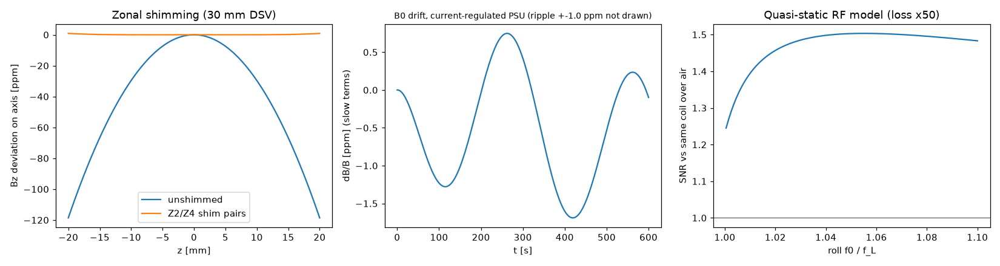
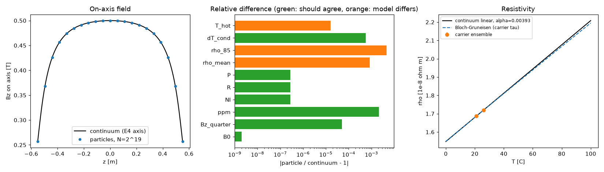
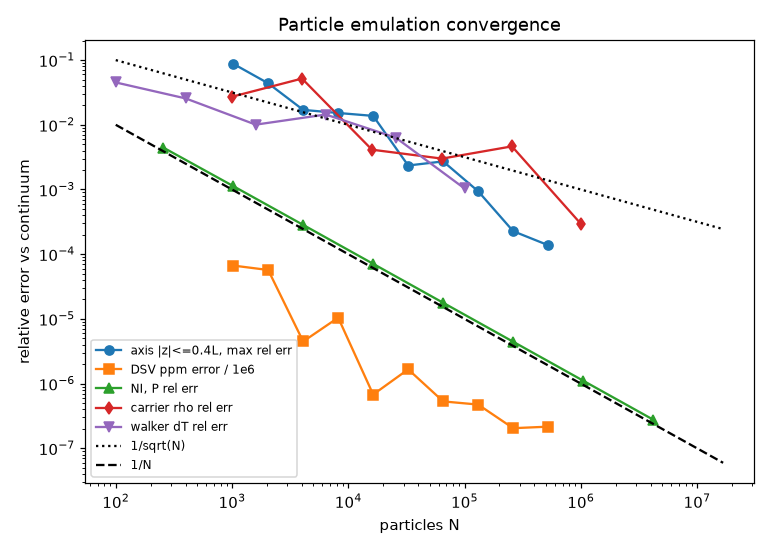
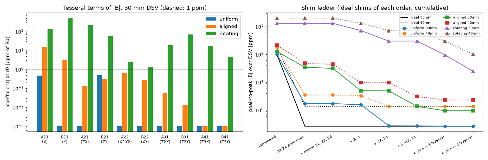
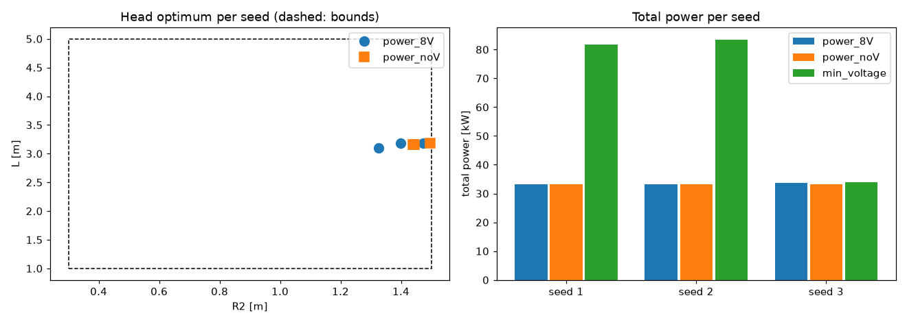
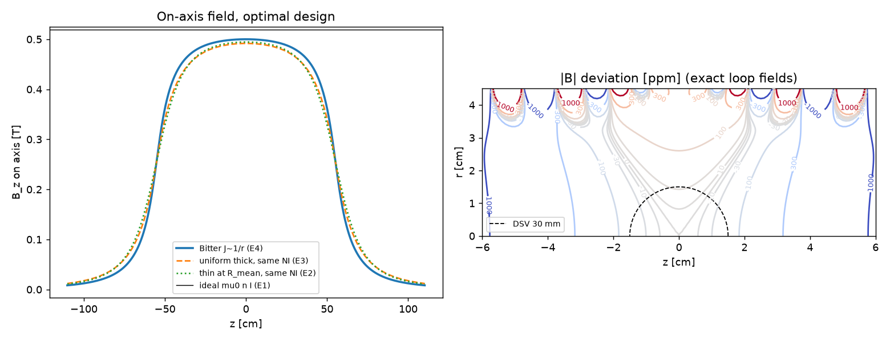
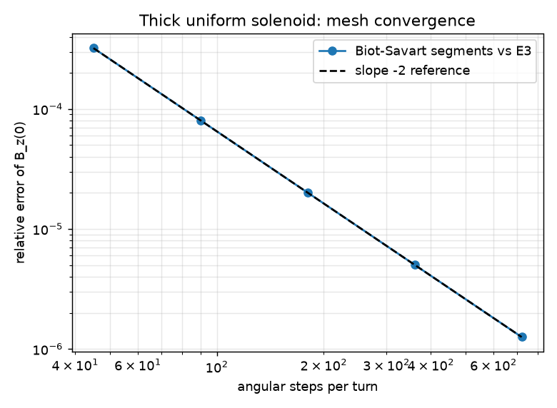
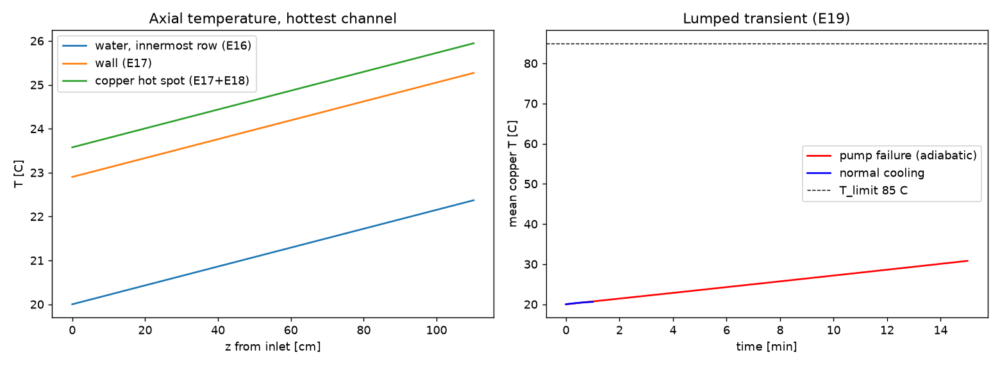
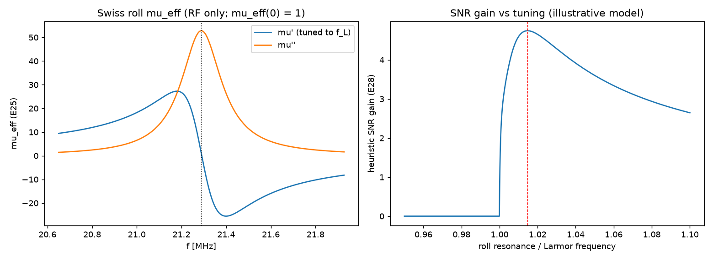
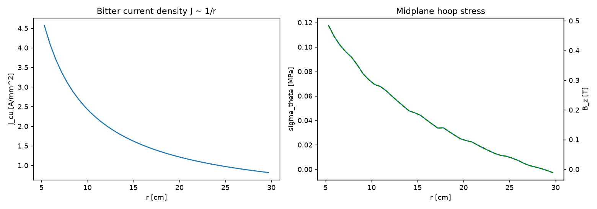

# bitter-solenoid-simulator

This is a real-time simulator for a **0.5 T water-cooled copper Bitter solenoid** with Swiss-roll RF metamaterials for early-stage fMRI. It implements *"Computational Blueprint for a Real-Time 0.5 Tesla Water-Cooled Copper Solenoid Simulator"*.

The constraints come from the blueprint:
- It runs on a 32 GB Ryzen 5 laptop, Kaggle and Colab.
- It uses only Python-3.6-compatible code and NumPy / SciPy / Numba / Matplotlib (plus ipywidgets) APIs that existed before July 2018. It uses no Magpylib, PyCharge or other later field libraries.

Every number below was produced by `examples/run_all.py` on python 3.13.5, numpy 2.5.3, scipy 1.18.1, numba 0.68.0, matplotlib 3.11.2. Nothing is hand-typed: `examples/make_docs.py` renders this file from `results/results.json`.

## Layout

```
package/bittersim/   simulation package
  elliptic.py        exact loop fields (scipy.special.ellipk/ellipe + Numba AGM kernel, prange-parallel)
  fields.py          ideal/thin/thick/Bitter closed forms, Gauss-loop winding model, DSV homogeneity
  biot_savart.py     blueprint straight-segment Biot-Savart engine (Numba, chunked), helical Bitter mesh, Richardson
  inductance.py      Maxwell mutual inductance, winding self-inductance, Nagaoka check
  design.py          coupled electrical / thermal / hydraulic evaluation of a design
  catalog.py         material allow-list (conductors, coolants, insulators, housings)
  emulation.py       mesoscopic emulation (Drude RVE, contact scatter, ONB flags; tolerance MC with workers=n); not molecular dynamics
  helical.py         helical Bitter current path (slit/overlap staircase, return bus) for the segment engine; harmonics and shim ladder
  particles.py       parallel particle emulation: Biot-Savart current elements, Green-Kubo carriers, Feynman-Kac heat walkers
  thermal.py         Re, Pr, Dittus-Boelter, Gnielinski, friction, pressure drop, hot spot, lumped transient
  mechanics.py       Lorentz force, hoop stress, axial compression
  swissroll.py       Pendry/Lorentzian mu_eff, skin-effect losses, heuristic SNR gain
  optimize.py        differential_evolution + SLSQP constrained optimisation
  harmonics.py       spherical-harmonic fit, Z2/Z4 shim loop pairs, tolerance (tesseral) model, head-bore preset
  stability.py       time-domain B0 stability: PSU ripple/drift, copper expansion, water-temperature drift
  rfsnr.py           quasi-static RF receive model: coil, Swiss-roll slab and tissue losses, SNR ratios
  validation.py      V&V suite used by VALIDATION.md
  cli.py             command line interface (python -m bittersim)
tests/               pytest: analytic limits, convergence, energy balance, web-demo parity, emulation
notebooks/           Colab/Jupyter notebook with ipywidgets sliders
docs/                GitHub Pages: index.html (overview), demo.html + bittersim.js (interactive demo, no install)
examples/            run_all.py (reproduces all results/figures), run_fmri.py (fMRI layer), make_docs.py, run_emulation.py, run_particles.py, run_helical.py, run_head.py
figures/ results/    generated outputs
VALIDATION.md        validation tables and plots    DESIGN_SUMMARY.md  equation-labelled summary for review
EMULATION.md         mesoscopic emulation grades, formulas, and non-goals
```

## Quickstart

```bash
pip install -r requirements.txt          # or: pip install -r requirements-2018.txt on Python 3.6.6
pip install -e .                         # optional; tests/examples also work without installing
python -m pytest -q tests
python -m bittersim evaluate             # blueprint initial-guess design
python -m bittersim evaluate --R2 0.3 --L 1.102 --d-plate 0.00599 --D-hole 0.005915 --v-flow 1.697 --pitch-factor 7.962
python -m bittersim optimise --maxiter 100
python -m bittersim field --rho 0 0.01 0.02 --z 0 0 0.01
python -m bittersim swissroll
python -m bittersim catalog
python -m bittersim emulate --realizations 50 --seed 1
python examples/run_emulation.py
python examples/run_all.py && python examples/run_fmri.py && python examples/make_docs.py   # regenerate everything
```

(Without `pip install -e .`, prefix the commands with `PYTHONPATH=package`.)

### Open in Colab

The repository is currently **public** (see the Pages note below). To use it in Colab:
1. Upload `notebooks/bitter_solenoid_realtime.ipynb` (File → Upload notebook).
2. Make the repo available in the session, either by uploading the repo folder or zip, or with `!git clone https://github.com/s-siyanwal/bitter-solenoid-simulator.git`.
3. Run all cells.

Kaggle works the same way: add the repo as a dataset.

### Web demo (no install)

`docs/index.html` is a short overview page. Open `docs/demo.html` in any browser, including from a file URL. The demo shows the basic sliders and results first. Everything below except the analytic core sits in a collapsed 'Advanced (work in progress)' section. The demo is a plain-JS port of the analytic core: E4 field, exact elliptic loop fields for homogeneity, the thermal and hydraulic model, and Swiss-roll μ_eff. `tests/test_webdemo.py` checks that it agrees with the Python model to 1e-9, and that the PDF-guess and seed-1 presets match the printed precision. The page draws the plate stack, a coarse Bz map, constraint chips, and a button-triggered emulation (quantile bars, a Langevin cloud in one representative volume, a pump-failure sketch). Every emulation panel is labelled mesoscopic emulation, not molecular dynamics. A reduced-N particle panel ports P1 (current elements: axis field and its error against E4, identical to Python at equal N; `tests/test_webdemo_particles.py`) and P2 (Green–Kubo carriers, statistically tested). An id that is not in the catalog is refused. The living write-up is [PROJECT_REPORT.md](PROJECT_REPORT.md) and [report/bitter_solenoid_report.tex](report/bitter_solenoid_report.tex). `examples/update_report.py` refreshes the numerical TeX tables after `run_all.py` or `run_emulation.py`.

### Simulation vs emulation

`evaluate` and `optimise` are the continuum simulator. `emulate` is a separate layer: a Drude representative volume, contact-resistance scatter, saturation and onset-of-nucleate-boiling flags, and percentile bands. It does not replace the continuum model, and it is not a particle model of the ~2575 kg magnet. Heuristics are labelled in the UI and in JSON as `model_grade`. The continuum optimum in the tables below is unchanged. See [EMULATION.md](EMULATION.md). `particles.py` (Numba-parallel current elements, carriers and heat walkers) re-derives the continuum numbers from particles; see 'Particle emulation vs continuum simulation' below.

The owner authorized making this repository public so GitHub Pages can serve `docs/` from `main`. The site is public at `https://s-siyanwal.github.io/bitter-solenoid-simulator/`. Private Pages would need Enterprise Cloud. Details are in [docs/HOSTING.md](docs/HOSTING.md).

## Physics summary

| block | model |
|---|---|
| Field, closed forms | ideal μ0nI; finite thin solenoid (cos θ1 + cos θ2); thick uniform solenoid (log form); Bitter J = C/r on axis: Bz(0) = μ0C[asinh(L/2R1) − asinh(L/2R2)] |
| Field, off-axis | winding as Gauss–Legendre coaxial loops with exact K(m), E(m) loop fields (Numba, prange); the blueprint's straight-segment Biot–Savart engine is used as an independent check |
| Bitter electrics | Laplace → J = V0/(2πρr), I_plate = V0 d ln(R2/R1)/(2πρ), P = V0² L ln(R2/R1)/(2πρ); fill factor for insulation and holes; current fixed so Bz(0) = 0.5 T |
| Thermal | ρ(T) iteration; axial holes, Dittus–Boelter (blueprint) plus Gnielinski check; ṁc_p dT/dz = q′; Newton cooling; in-plate conduction to the hole; hot spot at R1 / outlet; lumped transient (normal operation and pump failure) |
| Hydraulics | Re, Petukhov/laminar friction × optional stack multiplier (MON 10–20× on f only), Δp with minor losses, pump power |
| Contact R_c | Optional per-interface resistance in continuum R/V/P + overlap heat; headroom report |
| Hole grading | uniform (default) / montgomery / vinokur; per-ring hot spot |
| Mechanics | J×B, thin-ring hoop stress, axial compressive force |
| Swiss roll | μ_eff = 1 − Fω²/(ω²−ω0²+jωΓ) with Pendry's geometric ω0 and Γ, skin-effect sheet resistance, heuristic SNR gain. **RF only:** μ_eff(0) = 1, so it has no effect on static B0 or its homogeneity in this model |
| Optimisation | differential_evolution then SLSQP; minimise P_elec + P_pump subject to 0.5 T, T_hot ≤ 85 °C, V ≤ 8 V, R1 ≥ 50 mm, ≤ 100 ppm, Δp ≤ 5 bar, Re ≥ 1e4 |

The full equation list (E1–E32) is in [DESIGN_SUMMARY.md](DESIGN_SUMMARY.md).

## Results: optimal design

The differential-evolution run (seed 1, 10605 evaluations) took 112 s. The SLSQP polish did not improve it.

| ID | quantity | value |
|---|---|---|
| R1 | Optimal inner radius R1 | 50.01 mm |
| R2 | Optimal outer radius R2 | 300.00 mm |
| R3 | Optimal stack length L | 1102.0 mm |
| R4 | Plate thickness / insulator | 5.990 mm / 0.25 mm (assumed) |
| R5 | Number of plates (turns) | 176.6 |
| R6 | Cooling holes: diameter, pitch/D, count | 5.915 mm, 7.962, 115 holes in 5 rows |
| R7 | Ampere-turns NI for Bz(0) = 0.5 T | 454948 A |
| R8 | Current I | 2576.1 A |
| R9 | Supply voltage / voltage per plate V0 | 4.543 V / 25.725 mV |
| R10 | Resistance | 1.7635 mOhm |
| R11 | Copper current density at R1 / R2 | 4.856 / 0.810 A/mm^2 |
| R12 | Electrical power (rho at mean Cu temperature) | 11.704 kW |
| R13 | Pump shaft power (eta = 0.7) | 81.0 W |
| R14 | Isocentre field from exact loop model | 0.499999999 T |
| R15 | Homogeneity, peak-to-peak over 30 mm DSV | 99.95 ppm |
| R16 | Water velocity / total flow | 1.697 m/s / 321.8 L/min (5.35 kg/s) |
| R17 | Reynolds / Prandtl number | 10068 / 6.901 |
| R18 | h Dittus-Boelter / Gnielinski | 8098 / 8118 W/m^2K |
| R19 | Pressure drop (Darcy f = 0.0314) | 10.57 kPa |
| R20 | Mixed water outlet temperature (inlet 20 C) | 20.522 C |
| R21 | Hottest channel: water rise / film dT / conduction dT | 2.370 / 2.900 / 0.675 K |
| R22 | Maximum (hot-spot) copper temperature, at R1, outlet | 25.946 C |
| R23 | Mean copper temperature | 20.901 C |
| R24 | Max hoop stress (E21, field profile) / simple bound C B0/lambda | 0.1176 / 0.1214 MPa |
| R25 | Axial compressive force on each half | 3656 N |
| R26 | Inductance / stored energy / L/R time constant | 1.1589 mH / 3846 J / 0.657 s |
| R27 | Lumped thermal time constant (63 %) / pump-failure time to 85 C: lumped mean / hot-spot adiabatic bound | 54.3 s / 4922 s / 453 s |
| R28 | Copper mass | 2575 kg |
| R29 | Larmor frequency at 0.5 T | 21.288739 MHz |
| R30 | Swiss roll tuned exactly to f_L: mu_eff(f_L), Q | 1.000 + 52.81j, Q = 96.8 |
| R31 | Best roll tuning f0/f_L, mu_eff(f_L), legacy heuristic SNR gain (E28, superseded by R49) | 1.01475, 17.367 + 5.701j, 4.745 |
| R32 | Swiss roll mu_eff at DC | 1.0 + 0.0j (no static-field effect) |
| R33 | PDF initial guess (R2 = 0.15 m, L = 0.8 m, v = 2.5 m/s, 2 mm plates) | P = 17.974 kW, V = 19.537 V (violates 8 V), 154.15 ppm (violates 100 ppm), T_hot = 21.15 C |
| R34 | Energy-balance residual (sum of cell heats vs E31) | -1.6e-16 |

At the optimum:
- **Active limits:** homogeneity (100 ppm), R2 = 0.3 m, R1 = 50 mm, Re ≥ 1e4, and plate thickness and hole pitch near their upper bounds.
- **Large margins:** hot-spot temperature and supply voltage.

At 0.5 T the design is therefore driven by field quality and size, not by cooling. The blueprint's initial guess (R33) violates both the 8 V limit and the homogeneity target.

## fMRI layer: shims, head preset, B0 stability, RF SNR

`examples/run_fmri.py` writes `results/fmri.json` and `figures/fig7_fmri.png` from the published optimum (it does not rerun the optimiser). Modules: `harmonics.py` (spherical harmonics H1-H4, Z2/Z4 shim loop pairs, tolerance model, head preset), `stability.py` (S1-S4) and `rfsnr.py` (Q1-Q6). Every default input is an **assumption** and is copied into `fmri.json` under `assumptions`: shim J, head bore and DSV, PSU and chiller specs, the 1 ppm EPI target, coil, slab and tissue geometry, tissue conductivity, and the Swiss-roll loss multiplier.

| ID | quantity | value |
|---|---|---|
| R41 | Zonal Z2 / Z4 over 30 mm DSV (ppm at DSV radius, unshimmed) | -66.609 / -0.0585 |
| R42 | Peak-to-peak over 30 mm / 40 mm DSV: unshimmed -> Z2+Z4 shim pairs | 99.95 -> 0.264 ppm / 177.74 -> 1.364 ppm |
| R43 | Shim pairs: radius, z positions, NI, power (J = 2 A/mm^2 assumed) | 40.0 mm, +-20.0 / +-60.0 mm, 1.91 / 38.90 A, 0.689 W |
| R44 | Tesseral terms from 0.5 mm offset + 1 mrad tilt (assumed tolerance): A11 / B21 | -2.220 / 0.0888 ppm |
| R45 | Head preset (R1 = 190 mm, 200 mm DSV, <= 10 ppm after Z2/Z4; best on the old R2 <= 0.7 m grid, see R60 for the optimiser) | R2 700 mm, L 2600 mm, P 38.7 kW + pump 0.86 kW, 14.85 V, 2603 A, 31.5 t Cu, 1645 L/min, 1024 -> 9.92 ppm, T_hot 22.07 C (violates 8 V) |
| R46 | Field drift vs copper temperature at fixed current (numeric, isotropic expansion) | -16.500 ppm/K |
| R47 | B0 stability over 10 min, current-regulated PSU: ripple / drift / expansion / total | 2.000 / 0.333 / 2.527 / 4.439 ppm (94.5 Hz at f_L); voltage-regulated total 601.9 ppm |
| R48 | Max copper dT / water oscillation amplitude for 1 ppm (current / voltage mode) | 0.0606 / 2.54e-04 K ; 0.0459 / 1.93e-04 K |
| R49 | RF SNR, Swiss-roll slab vs same coil over air / vs coil on tissue (loss x50, best tuning f0/f_L) | 1.503 / 0.255 (f0/f_L = 1.0550, mu = 5.78 + 0.44j) |
| R50 | RF SNR vs air for loss multiplier 1 / 10 / 50 | 3.231 / 2.366 / 1.503 |
| R51 | RF resistances with slab: coil / tissue / slab | 0.0356 / 0.0359 / 0.1354 ohm |

How to read these numbers:
- **Shims.** Two thin-loop pairs inside the bore cancel Z2 and Z4. What is left is mostly Z6.
- **Head preset.** It sits at the upper end of the R2 grid in `head_preset()`, so it is not a converged optimum. The design is heavy and needs more than the 8 V supply. A copper-cost figure appears only when you pass a price: `head_preset(copper_usd_per_kg=...)`.
- **Stability.** At fixed current, B falls with copper temperature by the R46 coefficient (thermal expansion). A voltage-regulated supply adds the copper resistance coefficient on top, which gives the voltage-mode total in R47. So the magnet needs a current-regulated supply and chiller water held within the R48 amplitude.
- **RF.** This model is quasi-static: a surface loop, a laterally infinite uniaxial Swiss-roll slab, and a conducting half-space for the tissue. The roll array improves on the same coil held off over an air gap. It does not beat putting the coil straight on the tissue. The old E28 heuristic (R31) overstated the gain.
- **Helical path.** Tesseral terms from the helical current path are computed in the 'Helical current path' section below.



## Particle emulation vs continuum simulation

`examples/run_particles.py` writes `results/particles.json`, `figures/fig8_particles.png` and `figures/fig9_particle_convergence.png` for the seed-1 optimum. The code is in `package/bittersim/particles.py`. It is **not molecular dynamics**: the magnet holds about 10^28 atoms. Instead, three particle estimators each solve the same physics as one continuum formula, so each pair can be compared:

- **P1, current elements.** 524288 samples × 32 Biot–Savart point elements (rings of 16 plus the z-mirror) give B on the axis and on the 30 mm DSV. The same samples give NI, P, R and V. Continuum counterparts: E4, the exact loop model, and E31.
- **P2, conduction carriers.** 1000000 classical carriers follow an exact Ornstein–Uhlenbeck velocity process with relaxation time τ(T). The Einstein (Green–Kubo) relation σ = n e² D / (kT) turns this into ρ. τ(T) comes from a Bloch–Grüneisen lattice model (Θ_R = 343 K and RRR = 100, both assumptions) calibrated to ρ(20 °C) = 1.68e-8 Ω m. The continuum uses a linear ρ(T).
- **P3, heat walkers.** 100000 2-D Bessel random walks run from the hot cell's edge to the cooling-hole wall. Feynman–Kac turns their mean exit time into the conduction rise. Continuum counterpart: E18.

**Parallelism.** All kernels use Numba `prange`. Each particle owns a counter-based random stream (splitmix64 keyed by seed and index), and reductions are summed serially in fixed chunks. As a result, serial and parallel runs are bit-identical, and the run script checks this with `np.array_equal`. `emulate(..., workers=n)` draws every random number first, then evaluates the tolerance realizations in a spawn process pool, so its output is identical for any worker count. Each realization takes 6.0 ms serially, so process start-up dominates at this size (measured speedup in the last row below). The particle kernels are where the parallel speedup lives.

| kernel | N | serial [s] | parallel [s] | speedup | identical |
|---|---|---|---|---|---|
| P1 current elements (Biot-Savart, 404 DSV points) | 16384 | 4.908 | 0.747 | 6.57x | yes |
| P1 moments (NI, P) | 4194304 | 0.069 | 0.014 | 4.84x | yes |
| P2 carriers (Green-Kubo) | 200000 | 10.784 | 1.425 | 7.57x | yes |
| P3 heat walkers (Feynman-Kac) | 40000 | 17.629 | 2.223 | 7.93x | yes |
| emulate() tolerance MC, 8 processes | 2000 | 11.967 | 12.109 | 0.99x | yes |

| quantity | continuum | particle | rel. difference | stat. error (1 sigma) | expected |
|---|---|---|---|---|---|
| Isocentre field B0 [T] | 0.5 | 0.5 | +2.05e-09 | 0 (deterministic) | agree |
| Bz on axis at z = 0.275 m (L/4) [T] | 0.484516 | 0.484541 | +5.14e-05 | - | agree |
| Bz on axis at coil end z = L/2 [T] | 0.256869 | 0.256704 | -6.42e-04 | - | agree (slow MC) |
| Homogeneity over 30 mm DSV [ppm] | 99.9502 | 99.7344 | -2.16e-03 | - | agree (needs ~1e-7 rel. accuracy) |
| Ampere-turns NI [A] | 454948 | 454949 | +2.77e-07 | - | agree |
| Current I = NI / n_turns [A] | 2576.14 | 2576.14 | +2.77e-07 | - | agree |
| Resistance (rho at mean Cu T) [ohm] | 0.00176354 | 0.00176354 | -2.77e-07 | - | agree |
| Supply voltage [V] | 4.54313 | 4.54313 | +0.00e+00 | - | agree |
| Joule power (rho at mean Cu T) [W] | 11703.7 | 11703.8 | +2.77e-07 | - | agree |
| Resistivity at mean Cu T (20.901 C), carriers + Bloch-Gruneisen [ohm m] | 1.68595e-08 | 1.68738e-08 | +8.49e-04 | 1.41e-03 | differ (model) |
| Bloch-Gruneisen rho at mean Cu T (model value, no sampling noise) [ohm m] | 1.68595e-08 | 1.68587e-08 | -4.76e-05 | 0 (deterministic) | differ (model) |
| rho at 85 C (trip limit): Bloch-Gruneisen vs linear [ohm m] | 2.10916e-08 | 2.0993e-08 | -4.67e-03 | 0 (deterministic) | differ (model) |
| Joule power with carrier resistivity [W] | 11703.7 | 11713.7 | +8.49e-04 | 1.41e-03 | differ (model) |
| d(rho)/dT / rho20 at 20 C [1/K] | 0.00393 | 0.00387752 | -1.34e-02 | 0 (deterministic) | differ (model) |
| Hot-cell conduction rise (same q_v) [K] | 0.675091 | 0.674711 | -5.62e-04 | 2.86e-03 | agree |
| Hot-spot copper temperature (carrier rho + walkers) [C] | 25.9455 | 25.946 | +1.63e-05 | - | differ slightly (model) |
| Hot-spot copper temperature (Bloch-Gruneisen rho, walkers) [C] | 25.9455 | 25.9431 | -9.19e-05 | - | differ slightly (model) |

| ID | quantity | value |
|---|---|---|
| R52 | Particle emulation: speedup on 8 threads (field / carriers / walkers), serial == parallel bit-identical | 6.57x / 7.57x / 7.93x, yes |
| R53 | Particle vs continuum: B0, P (relative difference) | 2.05e-09 / 2.77e-07 |
| R54 | Particle vs continuum: DSV homogeneity | 99.73 ppm vs 99.95 ppm |
| R55 | Carrier (Bloch-Gruneisen) vs linear resistivity at mean Cu T | +0.085 % (+/- 0.141 % stat.) |
| R56 | Hot-spot copper T: particle / continuum | 25.946 / 25.946 C |

**Where they must agree, and where they should not:**
- **Agree to estimator error** (same equations, different numerical method): B on the axis, NI, I, R, V, P at the same ρ, and the conduction rise at the same heat source.
  - B0 at the isocentre agrees exactly, by construction. The P1 sampling density equals the E4 integrand, so that estimator has zero variance. B0 is therefore an implementation check, not an independent test. The residual 2.0e-09 is the loop model's own quadrature error against E4. The independent tests are the off-centre axis points and the DSV.
  - The axis error is largest near the coil ends: 1.4e-04 max for |z| ≤ 0.4 L, and 6.4e-04 including the ends. That is where the importance density is worst.
  - V = P / I, so the shared ⟨1/r⟩ error cancels in V.
- **Homogeneity.** The ppm figure needs about 1e-7 relative field accuracy, so it converges slowly with N (fig9). The continuum reference is the loop model evaluated on the same 404 points (99.95 ppm; R15 reports 99.95 ppm).
- **Should differ (different physics):**
  - ρ(T). The Bloch–Grüneisen slope at 20 °C differs from the linear α = 0.00393 1/K. The power and hot-spot temperature differ accordingly. Between 21 and 26 °C the model gap is small (-4.8e-05 at the mean Cu temperature), smaller than the 1e6-carrier sampling error (1.4e-03). It grows to -0.47 % at the 85 °C trip limit.
  - The emulated hot spot still takes the water rise and film drop from the continuum correlations, rescaled by the carrier ρ. Only conduction and resistivity come from particles.
- **Continuum contact resistance:** optional per-interface `R_c_ohm` (default 0) enters R, V, P and overlap-sector heat; V headroom is reported as max R_c/interface. Emulation still samples log-normal contacts.
- **Neither model includes:** a full Florida-Bitter elongated/staggered plate, or a turbulence-resolving CFD channel model. Classical carriers reproduce Drude σ under the relaxation-time approximation. Quantum (Fermi–Dirac) statistics change v_F and the mean free path, not σ.




## Helical current path: non-axisymmetric field errors

`examples/run_helical.py` writes `results/helical.json` and `figures/fig10_helical.png`. It uses the straight-segment Biot–Savart engine (`biot_savart.py`) and the path builder in `helical.py` to model the real Bitter current path for the seed-1 optimum. All geometry inputs below are assumptions:

- 177 flat plates, each carrying one turn with J = C/r across the plate, discretised into 96 radial filaments.
- A 30° overlap sector in which the current crosses to the next plate. In the model the crossing is a linear ramp in z over that sector.
- The circuit is closed by a return bus: radial leads at both ends and one axial bus at r = 350 mm.

Three path variants are compared with the ideal axisymmetric coil:

| variant | description |
|---|---|
| uniform | uniform-pitch helix |
| aligned | flat plates with every slit in one angular column |
| rotating | flat plates with each slit advanced by the overlap angle, plate to plate |

The rotating stack carries more than one turn per plate. Its current is rescaled by 0.9226 so that B0 is unchanged, and the same rescaling (≈1 for the other variants) is applied throughout.

**Method.**
- The helical error is dB = B(path) − B(planar rings on the same mesh), added to the converged loop model. Mesh error therefore cancels.
- The table reports the spherical harmonics of |B|, which is what the spins see. To first order |B| = Bz + B_perp²/(2 B0), so the transverse field enters too.
- Radial discretisation was checked at 48 vs 96 filaments (second-order convergence). The largest Richardson error estimate on any tesseral coefficient is 1.87 ppm overall and 0.016 ppm for the aligned stack.
- The ladder below nulls whole harmonic orders cumulatively with ideal shims. The orders "needed" come from the shortest prefix of the ladder that brings the coil within 1 ppm of the ideal coil's Z2/Z4-shimmed value (an assumed budget). Within that prefix, only orders whose step lowers p-p by at least 0.1 ppm are listed. "Terms ≥ 1 ppm" lists the individual coefficients at or above 1 ppm.

| DSV | path variant | p-p unshimmed | p-p after Z2/Z4 pairs | largest tesseral terms of abs(B) [ppm at r0] | max B_perp total / helical part [uT] | ideal shims needed (ladder) | terms >= 1 ppm |
|---|---|---|---|---|---|---|---|
| 30 mm | ideal | 99.95 | 0.26 | - | 17 / 0 | - | - |
| 30 mm | uniform | 100.46 | 1.72 | B21 +0.50, A11 +0.48 | 1786 / 1786 | X, Y, ZX, ZY | none |
| 30 mm | aligned | 126.19 | 34.42 | A11 +14.90, B11 -3.11, A22 +0.65, B21 +0.31 | 4117 / 4117 | Z, X, Y, X2-Y2, XY, n=3 | X, Y |
| 30 mm | rotating | 1300.60 | 1299.77 | B11 +516.49, A21 -224.68, A11 -138.22, B31 -70.94 | 1790 / 1777 | not reached with n <= 4 | Y, ZX, X, Z2Y, ZY, Z2X, Z3X, Z3Y, B51, X2-Y2, XY, ZXY, A51 |
| 40 mm | ideal | 177.74 | 1.36 | - | 30 / 0 | - | - |
| 40 mm | uniform | 178.44 | 3.49 | B21 +0.89, A11 +0.64, A22 +0.01 | 1810 / 1810 | X, Y, ZX, ZY | none |
| 40 mm | aligned | 215.24 | 47.85 | A11 +20.25, B11 -4.23, A22 +1.19, B21 +0.56 | 4545 / 4544 | Z, X, Y, X2-Y2, XY, n=3 | X, Y, X2-Y2 |
| 40 mm | rotating | 2009.08 | 2008.13 | B11 +688.67, A21 -399.42, A11 -184.29, B31 -168.16 | 1926 / 1909 | not reached with n <= 4 | Y, ZX, X, Z2Y, ZY, Z3X, Z2X, B51, Z3Y, A51, X2-Y2, A61, ZXY, XY, A42, Z(X2-Y2), B61 |

Peak-to-peak |B| [ppm] along the shim ladder:

| step | ideal 30 mm | uniform 30 mm | aligned 30 mm | rotating 30 mm | ideal 40 mm | uniform 40 mm | aligned 40 mm | rotating 40 mm |
|---|---|---|---|---|---|---|---|---|
| unshimmed | 99.95 | 100.46 | 126.19 | 1300.60 | 177.74 | 178.44 | 215.24 | 2009.08 |
| Z2/Z4 shim pairs (currents solved on the ideal coil) | 0.26 | 1.72 | 34.42 | 1299.77 | 1.36 | 3.49 | 47.85 | 2008.13 |
| + retune Z1, Z2, Z4 | 0.26 | 1.71 | 31.44 | 1300.41 | 1.36 | 3.48 | 44.09 | 2009.04 |
| + X, Y | 0.26 | 1.55 | 4.97 | 714.16 | 1.36 | 3.28 | 9.66 | 1304.68 |
| + ZX, ZY | 0.26 | 0.27 | 4.89 | 299.14 | 1.36 | 1.38 | 9.63 | 707.34 |
| + X2-Y2, XY | 0.26 | 0.27 | 1.36 | 299.70 | 1.36 | 1.38 | 3.06 | 708.05 |
| + all n = 3 tesseral | 0.26 | 0.26 | 0.95 | 95.83 | 1.36 | 1.36 | 2.30 | 296.25 |
| + all n = 4 tesseral | 0.26 | 0.26 | 0.95 | 24.88 | 1.36 | 1.36 | 2.30 | 103.40 |

**What this shows:**
- The Z2/Z4 pairs only remove zonal terms. The helical errors are mostly tesseral.
- With aligned slits, the slit column and its return bus act as an off-axis axial current. That produces a transverse field of the order of mT across the bore (R59) and X/Y gradient terms of |B|, so X and Y shims (plus higher orders, per the table) are needed.
- The uniform helix is close to the ideal coil.
- A stack whose slits rotate by the overlap angle each plate forms a short-pitch helix of transition currents. That produces large tesseral terms up to high order, which shims of order ≤ 4 cannot remove. A real design should avoid this stacking, or use a coaxial or bifilar return.
- Not modelled: plate-to-plate contact distribution, hole perforation of the current path, and lead geometry beyond the single bus.



## Head preset: optimisation

`examples/run_head.py` writes `results/head.json` and `figures/fig11_head.png` (run time about 16 min). It runs differential evolution with seeds 1–3 over R2, L, plate thickness, hole diameter, water velocity and pitch, at R1 = 190 mm and a 200 mm DSV.

- **Bounds (assumptions):** R2 up to 1.5 m, L up to 5 m, plates up to 20 mm, holes up to 8 mm.
- **Constraints:** ≤ 10 ppm after Z2/Z4 shims, T_hot ≤ 85 °C, Δp ≤ 5 bar, Re ≥ 1e4, with and without V ≤ 8 V.
- **Objective:** electrical + pump + shim power. A third run minimises the supply voltage instead.

| run | seed | R2 [mm] | L [mm] | plate [mm] | hole [mm] | v [m/s] | pitch/D | P_elec + pump + shim [kW] | V [V] | I [A] | Cu [t] | p-p shimmed [ppm] | T_hot [C] | bounds hit | active constraints |
|---|---|---|---|---|---|---|---|---|---|---|---|---|---|---|---|
| min power, V <= 8 V | 1 | 1474 | 3182 | 19.88 | 7.99 | 1.269 | 7.83 | 33.19 | 3.612 | 8702 | 186.8 | 9.90 | 21.26 | d_plate at upper bound, D_hole at upper bound | none |
| min power, V <= 8 V | 2 | 1326 | 3104 | 16.31 | 7.98 | 1.257 | 7.98 | 33.25 | 4.495 | 7111 | 146.5 | 9.94 | 21.43 | D_hole at upper bound, pitch_factor at upper bound | Re |
| min power, V <= 8 V | 3 | 1398 | 3184 | 16.59 | 8.00 | 1.265 | 7.71 | 33.65 | 4.423 | 7244 | 167.2 | 9.56 | 21.31 | D_hole at upper bound | none |
| min power, no V limit | 1 | 1496 | 3183 | 17.71 | 7.98 | 1.286 | 7.96 | 33.15 | 4.031 | 7775 | 192.4 | 9.98 | 21.25 | R2 at upper bound, D_hole at upper bound, pitch_factor at upper bound | none |
| min power, no V limit | 2 | 1445 | 3160 | 19.79 | 7.99 | 1.258 | 7.59 | 33.21 | 3.636 | 8657 | 178.0 | 9.98 | 21.26 | D_hole at upper bound | none |
| min power, no V limit | 3 | 1440 | 3162 | 18.70 | 7.97 | 1.270 | 7.92 | 33.13 | 3.853 | 8180 | 176.9 | 9.94 | 21.31 | D_hole at upper bound | none |
| min supply voltage | 1 | 1483 | 3179 | 20.00 | 3.47 | 3.063 | 8.00 | 81.68 | 3.578 | 8760 | 188.8 | 9.96 | 20.48 | d_plate at upper bound, pitch_factor at upper bound | none |
| min supply voltage | 2 | 1498 | 3188 | 19.98 | 5.10 | 3.516 | 7.61 | 83.53 | 3.579 | 8757 | 193.2 | 9.95 | 20.43 | R2 at upper bound, d_plate at upper bound | none |
| min supply voltage | 3 | 1496 | 3182 | 19.99 | 7.66 | 1.427 | 7.91 | 33.83 | 3.571 | 8762 | 192.3 | 9.99 | 21.16 | R2 at upper bound, d_plate at upper bound | ppm |

How to read it:
- **Power alone does not have an interior optimum here.** Power keeps falling slowly as R2 grows, so every seed ends near the widened R2 bound, with a very large copper mass. The hole diameter sits at its upper bound.
- **A practical head design needs a mass or cost term,** or a fixed R2. The table states which bounds bind.
- **The 8 V limit does not bind.** Thick plates mean fewer turns and a higher current at a low voltage.
- **The minimum supply voltage is set by the plate-thickness bound.**
- The old grid result (R45) is kept for reference.

| ID | quantity | value |
|---|---|---|
| R57 | Helical path, 30 mm DSV, p-p after Z2/Z4 pairs: ideal / uniform helix / aligned slits / rotating slits | 0.26 / 1.72 / 34.42 / 1299.77 ppm |
| R58 | Helical path, 40 mm DSV, p-p after Z2/Z4 pairs: ideal / uniform / aligned / rotating | 1.36 / 3.49 / 47.85 / 2008.13 ppm |
| R59 | Aligned slits, 30 mm DSV: X / Y terms of abs(B); max transverse field (total, with return bus) | 14.90 / -3.11 ppm; 4117 uT |
| R60 | Head preset optimum (DE, best of seeds 1-3, V <= 8 V): R2, L, plate, total power, V, Cu mass | 1474 mm, 3182 mm, 19.88 mm, 33.19 kW, 3.612 V, 186.8 t (seed spread in power 1.38 %) |
| R61 | Head preset: minimum achievable supply voltage (other constraints kept) | 3.571 V (R2 at upper bound, d_plate at upper bound) |



## Validation (details in [VALIDATION.md](VALIDATION.md))

| ID | quantity | value |
|---|---|---|
| R35 | Richardson order of convergence, segment engine (theory 2) | 1.999976 |
| R36 | Segment engine vs E3 (thick uniform), 360 angular steps | 1.090e-04 relative |
| R37 | Bitter 1/r helical filaments vs E4 (691200 segments) | 2.586e-04 relative |
| R38 | Loop model vs E3 / E4 closed forms (61 axial points) | 8.8e-14 / 1.9e-13 |
| R39 | Long-solenoid limit L/R = 1000 vs mu0 n I | 2.00e-06 relative |
| R40 | Numerical sheet inductance vs Nagaoka (worst of 3) | 2.5e-11 relative |

## Figures







## Assumptions (not specified in the blueprint)

- **Geometry:**
  - Insulator thickness is 0.25 mm.
  - Cooling holes are axial and run the full stack length L. Default layout is **uniform-density** round holes (equal pitch, n_per_row ∝ r) — this is *not* graded. Optional `hole_layout_mode=montgomery|vinokur` implements MON (a1/r)² or BETA Vinokur grading; `elongated_aspect>1` makes area-preserving elliptical holes. Hole area reduces the copper cross-section via f_h.
  - The helical lead and slit are neglected in the axisymmetric field (the segment engine quantifies their effect: about 5e-4 T of transverse field at the centre of the test coil, see VALIDATION §5).
- **Field quality:** homogeneity limit 100 ppm peak-to-peak over a 30 mm DSV, with no shimming.
- **Materials:**
  - Copper: α = 3.93e-3 /K, k = 390 W/mK, density 8960 kg/m³, c_p = 385 J/kgK. ρ is uniform in each evaluation (no radial ρ(T) variation in the current distribution).
  - Water properties are temperature-dependent correlations evaluated at the mean bulk temperature. Inlet water is 20 °C (blueprint code).
- **Hydraulics:** minor-loss coefficient 1.5, pump efficiency 0.7, Δp ≤ 5 bar, Re ≥ 1e4 (Dittus–Boelter validity). Laminar flow uses Nu = 4.36.
- **Hot spot:** innermost hole row at the outlet. Water rise in that channel uses only that cell's heat (no mixing). Film ΔT is taken over the copper part of the wall. In-plate conduction is modelled as an annulus with an insulated outer boundary.
- **Transient:** single lumped copper node, quasi-steady water.
- **Optimiser:** the objective adds pump power to electrical power. Plate thickness, hole diameter and pitch are extra design variables; voltage is derived, not free. Bounds are listed in `optimize.py`.
- **Swiss roll:**
  - Geometry: r = 5 mm, lattice 12 mm, N = 28 turns, ε_r = 3, 10 µm Cu foil. The gap is solved for resonance. Loss is 50× the ideal-foil value, giving Q ≈ 97, typical of reported MRI rolls.
  - SNR model: a heuristic (reciprocity coupling plus magnetic-circuit flux guide plus μ″ noise term, E28). It is illustrative only.
  - Copper diamagnetism (χ ≈ −1e-5), which could cause ppm-level B0 distortion in a real build, is not modelled.

## Not implemented / deviations

- **Particle / DFT model of the winding:** not implemented. `emulation.py` is a mesoscopic emulation of a representative volume plus catalog and contact scatter.
- **FEniCS curl-curl FEA cross-validation:** FEniCS 2017.2/2018.1 cannot be pip-installed on current Colab/Kaggle or here. It is replaced by independent cross-checks: closed forms, the loop model and the segment engine.
- **"Complete 3D thermal map" and full conjugate heat transfer:** replaced by a 1-D axial channel model plus a local conduction correction for the hottest cell.
- **Analytic Jacobians/Hessians for SLSQP/trust-constr:** not used. The hole layout makes the objective piecewise, so the run uses DE plus SLSQP with finite differences (trust-constr is available but not needed).
- **Blueprint text vs. this code:**
  - The blueprint code's objective plugs the *total* 8 V into the per-plate power formula E31. Here V0 is the per-plate voltage, so P = V_total·I.
  - The blueprint states the turns-per-metre and power figures of its wire-wound example without derivation; they are not reproduced.
- **Versions:** numba 0.39.0 is listed in the blueprint as June 2018, but it was released 2018-07-11, so `requirements-2018.txt` pins 0.38.1.

## CI

`.github/workflows/tests.yml` runs pytest on Python 3.10 and 3.12 with current packages. A second job runs it in a `python:3.6.6` container with the pinned 2018 stack; that job is allowed to fail.

